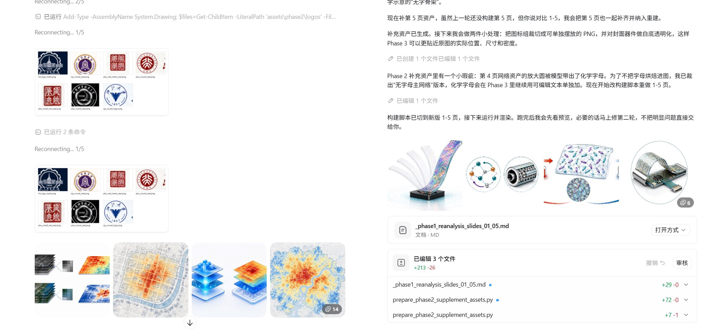
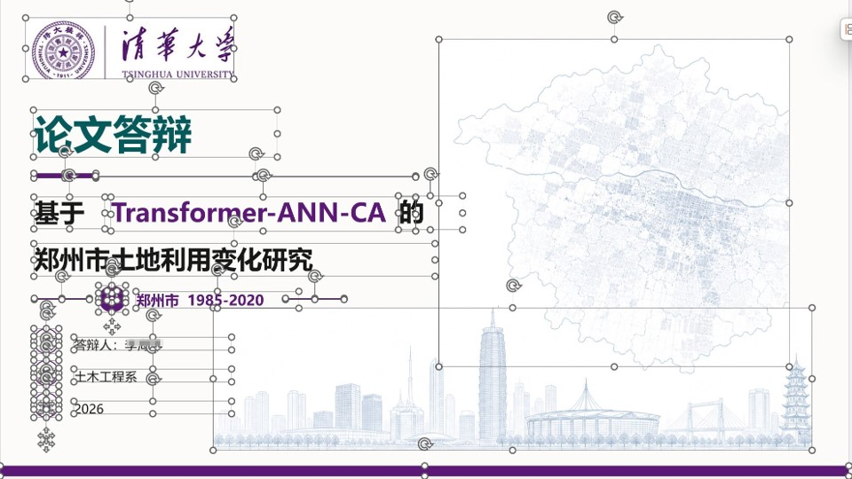
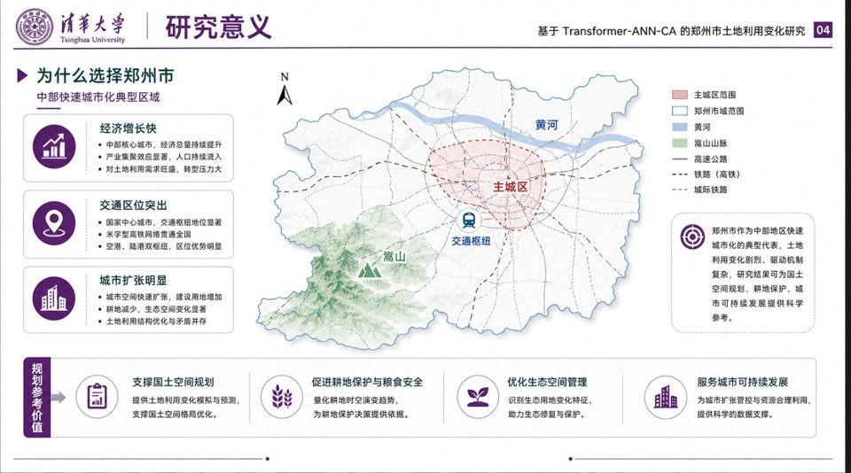
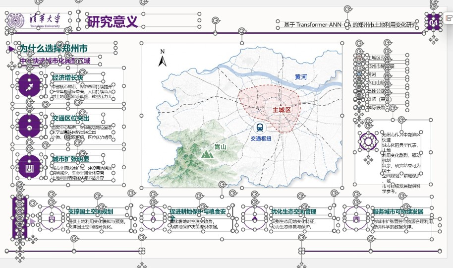

<div align="center">

# Slide Image → Editable PPTX

### High-Fidelity Conversion of Slide Screenshots into Editable PowerPoint

[](https://developers.openai.com/codex/skills)
[](#compatibility)
[](LICENSE)
[](https://github.com/gitbrent/PptxGenJS)

**Turn slide screenshots into pixel-accurate, fully editable PowerPoint files.**

Text stays editable. Complex visuals become clean AI-generated PNGs. Simple shapes become native PPT objects.

English | [中文](README_ZH.md)

<p align="center">
  
</p>

</div>

---

## The Problem

You have a set of PPT slide images (screenshots, exported PNGs, or AI-generated mockups) and you want them back as an **editable** `.pptx` file — not a deck of full-slide screenshots pasted as backgrounds.

Existing approaches fail in predictable ways:

| Approach | Result |
|----------|--------|
| Paste screenshots as backgrounds | Zero editability |
| Ask AI to "recreate" the PPT | Gets the topic right but layout wrong — a new template, not a reconstruction |
| Manual recreation | Hours of tedious work per slide |

## The Solution

This skill teaches Codex (or any compatible AI coding agent) to **decompose each slide image into three layers**, then rebuild them as a real PowerPoint file:

| Layer | Contains | Implementation | Editable? |
|-------|----------|----------------|-----------|
| **A — Visual Assets** | Complex illustrations, photos, scientific figures, icons, decorative backgrounds | AI-generated PNG (`$imagegen`) — no text baked in | Replaceable |
| **B — Structure** | Rectangles, cards, panels, lines, arrows, dividers, badges | Native PPT shapes | Fully editable |
| **C — Content** | All readable text: titles, labels, body text, page numbers, captions | Native PPT text boxes | Fully editable |

## How It Works

The skill runs in three phases, each in its own context window for maximum quality:

```
┌──────────────────┐     ┌──────────────────┐     ┌──────────────────┐
│   Phase 1        │     │   Phase 2        │     │   Phase 3        │
│                  │     │                  │     │                  │
│  Pixel-Level     │────▶│  Visual Asset    │────▶│  PPT Assembly    │
│  Analysis        │     │  Generation      │     │  & Validation    │
│                  │     │                  │     │                  │
│  • Inspect each  │     │  • Generate PNG  │     │  • Build PPTX    │
│    slide image   │     │    for each      │     │    with native   │
│  • Classify      │     │    Layer A       │     │    shapes & text │
│    every element │     │    element       │     │  • Render &      │
│  • Map positions │     │  • No text in    │     │    compare with  │
│    & layers      │     │    any image     │     │    source        │
│  • Self-check    │     │  • Verify each   │     │  • 5 slides per  │
│    for missed    │     │    asset         │     │    batch         │
│    elements      │     │                  │     │                  │
└──────────────────┘     └──────────────────┘     └──────────────────┘
```

### Classification Logic

This classification step is the heart of the reconstruction process: each visible element is assigned to visual assets, native PPT structure, or editable text before the deck is rebuilt.

<p align="center">
  
</p>

### Phase 1: Pixel-Level Analysis

The agent inspects each source image and catalogs every visible element with its type, position (bounding box), layer classification, and implementation method. A **completeness self-check** (Step 1.4) ensures small icons, in-card illustrations, and decorative details are not missed.

**Output**: `analysis/<project>/phase1-analysis.md` — a structured element inventory for all slides.

### Phase 2: Visual Asset Generation

For each Layer A element, the agent generates a clean PNG using `$imagegen` with precise prompts that specify content, style, colors, aspect ratio, and transparency — and always end with **"No text, no labels, no numbers."**

**Output**: `assets/<project>/` with all generated PNGs + `analysis/<project>/phase2-assets.md` report.

The image below shows Phase 2 in practice: the agent turns identified Layer A elements into clean visual assets before the final PowerPoint assembly.



### Phase 3: PPT Assembly

The agent builds the PPTX using `@presentations` (PptxGenJS), stacking elements in correct z-order: background → visual assets → structural shapes → text boxes → brand elements. Slides are built in batches of 5 with rendering and self-validation after each batch.

**Output**: `output/<project>/` with the final `.pptx` file, rendered previews, and `validation_report.md`.

## Quick Start

### Installation

Copy the skill folder into your Codex skills directory:

```bash
# Clone or download
git clone https://github.com/YOUR_USERNAME/slide-image-to-editable-pptx.git

# Copy to Codex skills directory
cp -r slide-image-to-editable-pptx ~/.codex/skills/
```

Or install via CC Switch: Skills panel → Add from GitHub → paste the repo URL.

### Usage

**Recommended: 3-prompt workflow** (best quality, each phase gets full context window)

**Prompt 1** — Analysis:
```
Please use the $slide-image-to-editable-pptx skill to convert the slide images 
in this folder into an editable PPTX. Visual fidelity must match the source images. 
All text must be editable. Complex visuals use $imagegen to generate clean PNGs. 
Strictly follow Phase 1 first — complete the analysis including Step 1.4 
completeness self-check (ensure no small icons, in-card illustrations, or 
decorative details are missed). Output the full element inventory for my review 
before proceeding to Phase 2.
```

**Prompt 2** — Asset Generation:
```
Proceed to Phase 2. Output the asset report for my review. 
Do not proceed to Phase 3 until I confirm.
```

**Prompt 3** — PPT Assembly:
```
Proceed to Phase 3. Use @presentations to build the PPTX. 
The PNG assets in assets/<project>/ are ready. Follow the element inventory in analysis/<project>/phase1-analysis.md
to reconstruct each slide — match the source images' exact positions, sizes, 
and element density. Build slides 1-5 first, render screenshots for my review, 
then continue with 6-10, 11-15, etc.
```

### File Structure

For repeatable runs, choose one stable `<project>` folder name for each PPT and
reuse it across the major workflow folders:

```text
your-project/
├── source_slides/<project>/     # Input slide images for one PPT
│   ├── slide_01.png
│   ├── slide_02.png
│   └── ...
├── analysis/<project>/          # Phase notes and validation reports
│   ├── phase1-analysis.md
│   ├── phase2-assets.md
│   └── validation_report.md
├── assets/<project>/            # Generated or preserved Layer A PNG assets
├── output/<project>/            # Final PPTX and rendered previews
│   ├── final.pptx
│   ├── previews/
│   └── render/
├── scripts/<project>/           # Optional project-specific helper scripts
└── scripts/_shared/             # Optional helpers reused across projects
```

Keep the final PPTX directly under `output/<project>/`. Avoid timestamp wrapper
folders such as `output/manual-YYYYMMDD-HHMM/presentations/...`, and do not put
project files directly in the root of `source_slides/`, `analysis/`, `assets/`,
`output/`, or `scripts/`.

## Key Design Decisions

### Why Three Separate Phases?

AI coding agents have limited context windows (~200K tokens). Running all phases in one shot means each phase gets only a fraction of the available context. Splitting into three phases ensures:

- **Phase 1** uses full context for thorough analysis
- **Phase 2** uses full context for high-quality image generation
- **Phase 3** uses full context for precise PPT code

### Why Not Just Use Full-Slide Screenshots?

Full-slide screenshots give you zero editability. The whole point is to make text editable and shapes adjustable while preserving the visual appearance.

### Why Generate Images Instead of Cropping from Source?

Cropping from slide screenshots produces low-resolution, dirty-edged fragments. AI-generated images are clean, high-resolution, and properly transparent — resulting in a much more professional output.

### Why Not Rebuild Everything with Native PPT Shapes?

Some visual elements (radar scenes, scientific illustrations, campus sketches, decorative textures) are too complex for PPT shapes. Forcing them into shapes produces ugly, crude approximations. AI-generated PNGs preserve visual fidelity.

## Common Failure Modes & How the Skill Prevents Them

| Failure Mode | Symptom | Prevention |
|-------------|---------|------------|
| **New template** | Output looks like a different PPT on the same topic | Phase 1 forces pixel-level position measurement |
| **Generic motif spam** | Same background image on every slide | Each slide gets unique assets matched to its source |
| **Over-native crude shapes** | Complex visuals rendered as ugly PPT approximations | Classification rules route complex visuals to `$imagegen` |
| **Baked text** | Text visible but not editable (inside images) | All `$imagegen` prompts end with "No text" |
| **Missed elements** | Small icons or details missing from output | Step 1.4 completeness self-check catches omissions |

## Compatibility

| Platform | Status | Notes |
|----------|--------|-------|
| OpenAI Codex | Fully supported | Primary target. Uses `$imagegen` + `@presentations` |
| Claude Code | Compatible | Use with appropriate image generation and PPTX skills |
| Other AI agents | Adaptable | Any agent with image generation + PptxGenJS access |

## Examples

These screenshots show the kind of slide-image reconstruction workflow this skill is designed for: source slides are analyzed visually, rebuilt as editable PowerPoint objects, and checked against rendered previews.

### Reconstruction Gallery

#### Example 1


#### Example 2

| Image Version | Editable Version |
| :---: | :---: |
|  |  |

#### Example 3

| Image Version | Editable Version |
| :---: | :---: |
|  |  |

## Contributing

Issues, suggestions, and PRs are welcome!

If you've used this skill to convert slides and want to share before/after examples, please open a PR — real-world examples help other users understand what to expect.

## License

MIT

## Acknowledgments

- [PptxGenJS](https://github.com/gitbrent/PptxGenJS) — The JavaScript library that makes programmatic PPTX creation possible
- [OpenAI Codex](https://openai.com/codex/) — The AI coding agent platform
- [CC Switch](https://github.com/farion1231/cc-switch) — Inspiration for project documentation structure
